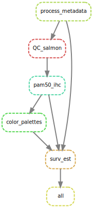

# Post-partum breast cancer

This repository contains the code for the analysis of RNA-seq data from the KWF project "Postpartum breast cancer diagnosed during involution: a distinct entity with unique clinicopathological, molecular and immunological features"

